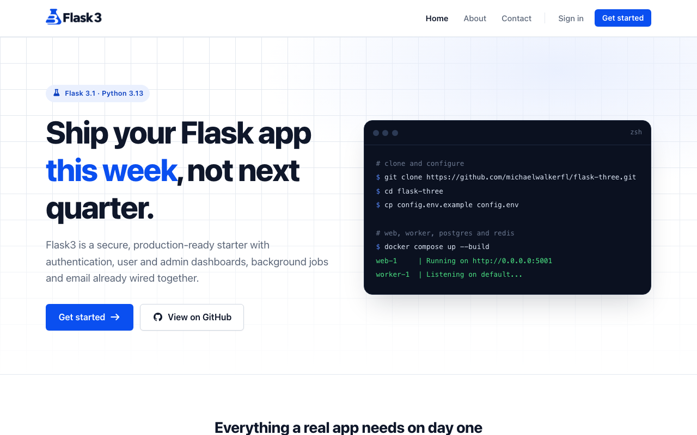
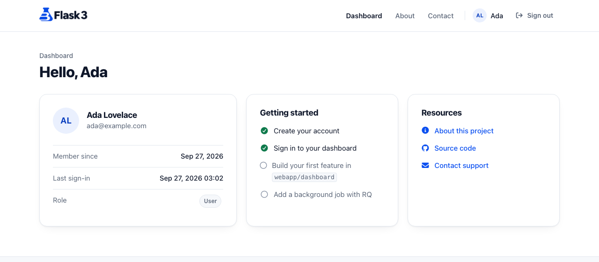
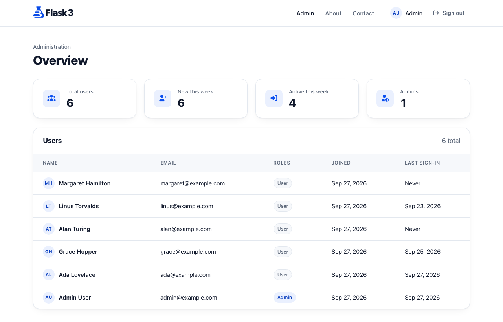
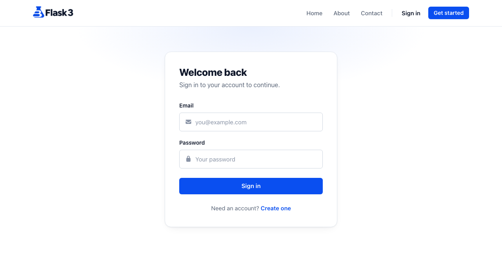
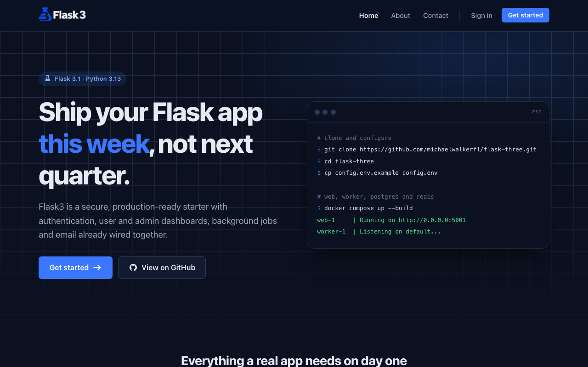

<p align="center">
  <picture>
    <source media="(prefers-color-scheme: dark)" srcset="webapp/static/images/flask-3-logo-dark.png">
    
  </picture>
</p>

<p align="center">
  A secure, production-ready <strong>Flask 3</strong> starter with authentication, user and admin dashboards,<br>
  background jobs, transactional email and a clean, responsive UI.
</p>

<p align="center">
  <a href="https://github.com/michaelwalkerfl/flask-three/actions/workflows/ci.yml"></a>
  
  
  
  
  <a href="LICENSE"></a>
</p>

<p align="center">
  
</p>

## Features

- **Authentication and roles** - registration, sign-in, sign-out, scrypt password hashing, `user` and `admin` roles, safe `?next=` redirects.
- **User dashboard** - profile details, sign-in history and a getting-started checklist.
- **Admin dashboard** - user metrics (total, new, active, admins) and a paginated user directory.
- **Secure by default** - CSRF on every form, nonce-based Content Security Policy via Flask-Talisman, HTTPS enforcement, hardened session cookies in production.
- **Background jobs** - Redis Queue (RQ) worker for email and other slow tasks.
- **Transactional email** - Flask-Mail over SMTP (SendGrid defaults) and a working contact form that emails the admin.
- **Server-side sessions** - Flask-Session backed by Redis.
- **Modern UI** - no build step, light and dark themes, responsive down to mobile, Font Awesome icons, accessible markup.
- **Docker Compose** - web, worker, PostgreSQL 17 and Redis 7 with health checks, in one command.
- **Quality tooling** - pytest suite with coverage, Ruff linting and formatting, GitHub Actions CI on Python 3.12 to 3.14.

## Screenshots

| User dashboard | Admin dashboard |
| --- | --- |
|  |  |
| **Sign in** | **Dark mode** |
|  |  |

## Quick start (Docker)

```bash
git clone https://github.com/michaelwalkerfl/flask-three.git
cd flask-three
cp config.env.example config.env   # then edit the values
docker compose --env-file config.env up --build
```

Or run `./run.sh`, which creates `config.env` on first run and then starts the stack.

| Service | Address |
| --- | --- |
| Web app | http://127.0.0.1:5001 |
| PostgreSQL | `localhost:5433` |
| Redis | `localhost:6379` |

On startup the container creates any missing tables, the `admin` and `user` roles, and the admin account from `ADMIN_EMAIL` / `ADMIN_PASSWORD`. Setup is idempotent and never deletes data. Sign in with the admin credentials to open the admin dashboard.

## Local setup (without Docker)

Requires Python 3.12+ and a running Redis server.

```bash
python3 -m venv .venv
source .venv/bin/activate          # Windows: .venv\Scripts\activate
pip install -r requirements-dev.txt

cp config.env.example config.env
# For local development, point these at your machine:
#   DEVELOPMENT_DATABASE=sqlite:///development-database.sqlite  (or a local Postgres URL)
#   SESSION_REDIS=redis://localhost:6379/0

flask --app wsgi create-database
flask --app wsgi create-roles
flask --app wsgi create-admin

flask --app wsgi run --debug --port 5001   # add --cert=adhoc to serve over HTTPS
rq worker default --url redis://localhost:6379/0   # in a second terminal, for email
```

## CLI commands

| Command | Description |
| --- | --- |
| `flask create-database` | Create missing tables. Safe to run repeatedly. |
| `flask create-database --drop` | Drop and recreate all tables (asks for confirmation, destroys data). |
| `flask create-roles` | Create the `admin` and `user` roles if missing. |
| `flask create-admin` | Create the admin user from `ADMIN_EMAIL` / `ADMIN_PASSWORD` if missing. |

## Testing and linting

Tests run against in-memory SQLite and need neither Redis nor PostgreSQL.

```bash
pytest --cov              # tests with coverage
ruff check .              # lint
ruff format --check .     # formatting
```

## Configuration

Settings are read from environment variables, loaded from `config.env` if present. See [`config.env.example`](config.env.example).

| Variable | Description | Default |
| --- | --- | --- |
| `APP_ENV` | Config profile: `development`, `test`, `production`, `ubuntu` | `development` |
| `APP_NAME` | Display name used in the UI | `Flask3` |
| `FLASK_SECRET_KEY` | Secret key for sessions and CSRF. **Required in production.** | - |
| `DEVELOPMENT_DATABASE` | Database URL for development | SQLite file |
| `PRODUCTION_DATABASE` | Database URL for production | SQLite file |
| `TEST_DATABASE` | Database URL for tests | in-memory SQLite |
| `SESSION_REDIS` | Redis URL for sessions (and RQ by default) | `redis://redis:6379/0` |
| `RQ_REDIS_URL` | Redis URL for background jobs | value of `SESSION_REDIS` |
| `RQ_QUEUE` | RQ queue name | `default` |
| `EMAIL_ASYNC` | Queue email on RQ (`true`) or send inline (`false`) | `true` |
| `MAIL_SERVER` / `MAIL_PORT` | SMTP host and port | `smtp.sendgrid.net` / `587` |
| `MAIL_USE_TLS` / `MAIL_USE_SSL` | SMTP transport security | `true` / `false` |
| `MAIL_USERNAME` / `MAIL_PASSWORD` | SMTP credentials | - |
| `MAIL_DEFAULT_SENDER` | From address for outgoing mail | `ADMIN_EMAIL` |
| `ADMIN_EMAIL` / `ADMIN_PASSWORD` | Admin account; `ADMIN_EMAIL` also receives contact form messages | - |
| `FORCE_HTTPS` | Redirect HTTP to HTTPS (skipped in debug mode) | `true` |
| `REPOSITORY_URL` | Link used for the GitHub buttons in the UI | this repository |

## Project structure

```
flask-three/
├── config.py               # Config profiles (development, test, production, ubuntu)
├── wsgi.py                 # WSGI entry point (gunicorn wsgi:app)
├── webapp/
│   ├── __init__.py         # Application factory, extensions, security headers
│   ├── commands.py         # Flask CLI commands
│   ├── utils.py            # Template helpers and email queueing
│   ├── models/             # SQLAlchemy models (User, Role)
│   ├── public/             # Home, about, contact
│   ├── dashboard/          # Auth and the user dashboard
│   ├── admin/              # Admin dashboard
│   ├── templates/          # Jinja2 templates
│   └── static/             # CSS design system, JS, images
├── tests/                  # pytest suite (unit + functional)
├── Dockerfile              # Production image (gunicorn, non-root)
├── docker-compose.yml      # Development stack: web, worker, db, redis
└── .github/workflows/      # CI: lint, test matrix, Docker build
```

## Deploying to production

The Docker image defaults to `APP_ENV=production` and serves the app with gunicorn on port 5001:

```bash
docker build -t flask-three .
docker run -p 5001:5001 --env-file config.env \
  -e APP_ENV=production -e DB_HOST=<db-host> -e REDIS_HOST=<redis-host> flask-three
```

Run a worker from the same image with `rq worker default --url "$SESSION_REDIS"`. In production, set `FLASK_SECRET_KEY` and `PRODUCTION_DATABASE`, and run behind a TLS-terminating proxy that sets `X-Forwarded-Proto`.

## License

MIT - see [LICENSE](LICENSE).
